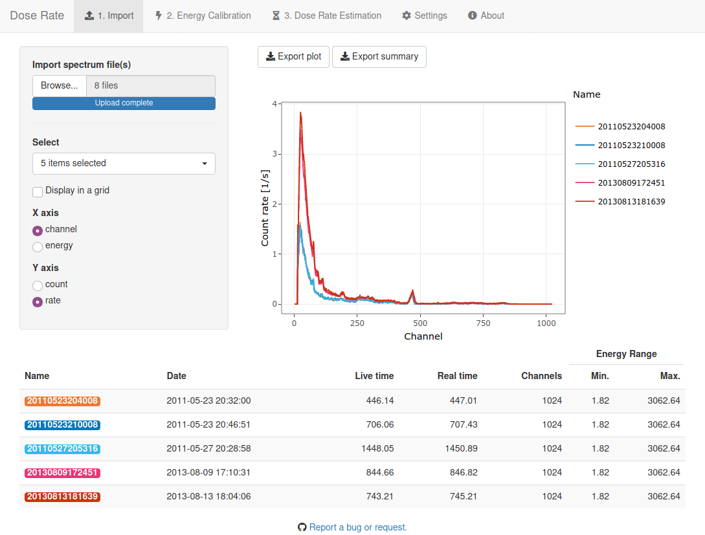

<!-- README.md is generated from README.Rmd. Please edit that file -->

# gammaShiny 

<!-- badges: start -->

[](https://github.com/crp2a/gammaShiny/actions/workflows/R-CMD-check.yaml)

[](https://crp2a.r-universe.dev)

[](https://www.repostatus.org/#active)

[](https://doi.org/10.5281/zenodo.4139005)
<!-- badges: end -->

## Overview

A collection of [**shiny**](https://shiny.rstudio.com) application that
provides exhanced graphical user interfaces for the
[**gamma**](https://github.com/crp2a/gamma) package.

    To cite gammaShiny in publications use:

      Lebrun B, Frerebeau N, Paradol G, Guérin G, Mercier N, Tribolo C,
      Lahaye C, Rizza M (2020). "gamma: An R Package for Dose Rate
      Estimation from In-Situ Gamma-Ray Spectrometry Measurements."
      _Ancient TL_, *38*(2), 1-5.

      Frerebeau N, Lebrun B, Kreutzer S (2024). _gammaShiny: shiny
      Applications for the R Package gamma_. Université Bordeaux Montaigne,
      Pessac, France. doi:10.5281/zenodo.4139005
      <https://doi.org/10.5281/zenodo.4139005>, R package version 0.2.0.

## Installation

You can install **gammaShiny** from [our
repository](https://crp2a.r-universe.dev) with:

``` r
options(repos = c(CRAN = "https://cloud.r-project.org",
                  crp2a = "https://crp2a.r-universe.dev"))

install.packages("gammaShiny")
```

## Usage

``` r
# Load the package
library(gammaShiny)

# Run the app for gamma dose rate estimation
run_app("doserate")
```



## Contributing

Please note that the **gammaShiny** project is released with a
[Contributor Code of
Conduct](https://github.com/crp2a/gammaShiny/blob/master/.github/CODE_OF_CONDUCT.md).
By contributing to this project, you agree to abide by its terms.

## Acknowledgements

This work received a state financial support managed by the Agence
Nationale de la Recherche (France) throught the program *Investissements
d’avenir* (ref. 10-LABX-0052 and 11-IDEX-0001).
